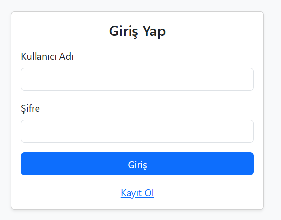
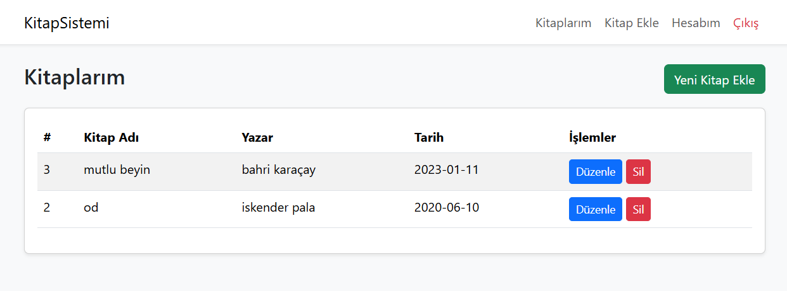
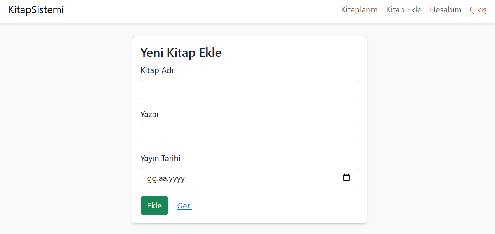
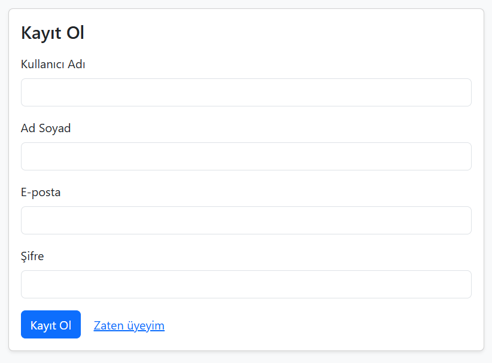
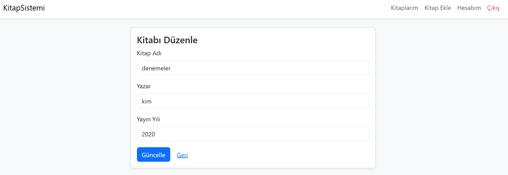

<<<<<<< HEAD
# Kitap Kayıt Sistemi 📚

Bu proje, kullanıcıların kendi kitap listelerini oluşturmalarına, yeni kitaplar eklemelerine ve mevcut kitaplarını yönetmelerine olanak tanıyan web tabanlı bir **Kitap Yönetim Sistemi**dir.

## 🚀 Projenin Amacı
Bu uygulamanın temel amacı, kişisel bir kütüphane yönetim deneyimi sunmaktır. Kullanıcılar üyelik oluşturarak sisteme giriş yapabilir ve kendilerine özel kitap koleksiyonlarını dijital ortamda takip edebilirler.

## 🛠️ Kullanılan Teknolojiler
Proje geliştirilirken aşağıdaki teknolojiler kullanılmıştır:
- **PHP**: Sunucu taraflı programlama dili.
- **MySQL**: Veri yönetimi ve depolama için ilişkisel veritabanı.
- **Bootstrap 5**: Modern ve duyarlı (responsive) arayüz tasarımı.
- **HTML5 & CSS3**: Sayfa yapısı ve görsel düzenlemeler.

## 📄 Sayfalar ve Özellikler
1.  **Giriş ve Kayıt (login.php, register.php):** Kullanıcıların sisteme güvenli bir şekilde erişmesini sağlar.
2.  **Kitap Listesi (index.php):** Kullanıcının eklediği tüm kitapları listelediği ana ekran.
3.  **Kitap Ekleme (kitap_ekle.php):** Koleksiyona yeni kitap bilgilerinin (ad, yazar, tür vb.) girildiği alan.
4.  **Düzenleme ve Silme (kitap_duzenle.php, kitap_sil.php):** Mevcut kitap bilgilerini güncelleme veya listeden kaldırma işlemleri.
5.  **Profil Yönetimi (uye_duzenle.php):** Kullanıcı bilgilerinin güncellenebildiği bölüm.

## 📸 Ekran Görüntüleri

### 🔐 Giriş Ekranı

### 📖 Kitap Listesi

### ➕ Yeni Kitap Ekleme

### 📝 Üye Kayıt

### ✏️ Kitabı Düzenle

## ⚙️ Kurulum
1.  Veritabanı sunucunuzda (MySQL) `kitap_sistemi` adında bir veritabanı oluşturun.
2.  Proje klasöründeki `kitap_sistemi.sql` dosyasını bu veritabanına içe aktarın (import).
3.  `db.php` dosyasındaki veritabanı bağlantı bilgilerini kendi sunucu ayarlarınıza göre düzenleyin.
4.  Projeyi bir PHP sunucusu (XAMPP, WAMP vb.) üzerinden çalıştırın.
=======
# Kitap Sistemi - Bootstrap 5
Eğitim amaçlı PHP + MySQL proje.
Çalıştırmak için:
1. XAMPP'ı başlatın (Apache + MySQL).
2. `kitap_sistemi.sql` dosyasını phpMyAdmin ile içe aktarın.
3. Klasörü `C:/xampp/htdocs/kitap_sistemi` (veya benzeri) içine kopyalayın.
4. Tarayıcıda `http://localhost/kitap_sistemi/login.php` adresini açın.
>>>>>>> 9637f3e (Admin yönetimi ve kullanıcı silme özellikleri eklendi)
